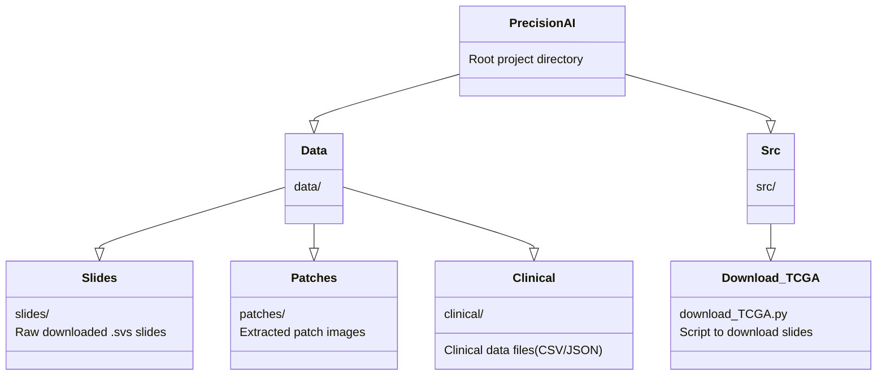

```mermaid
classDiagram
    PrecisionAI --|> Data
    PrecisionAI --|> Src
    Data --|> Slides
    Data --|> Patches
    Data --|> Clinical
    Src --|> Download_TCGA
    
    class PrecisionAI{
        Root project directory
    }
    class Data{
        data/
    }
    class Slides{
        slides/
        Raw downloaded .svs slides
    }
    class Patches{
        patches/
        Extracted patch images
    }
    class Clinical{
        clinical/
        Clinical data files (CSV/JSON)
    }
    class Src{
        src/
    }
    class Download_TCGA{
        download_TCGA.py
        Script to download slides
    }
```